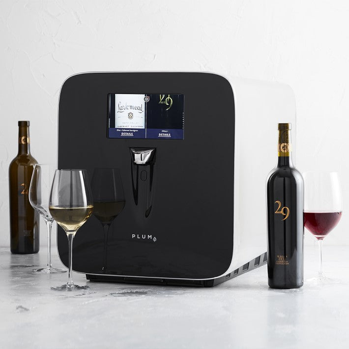

# Resources for Plum Wine Appliance Owners
While the original Plum wine appliance is no longer in production (its name and patented technology have been acquired by C+A Global), many owners of this at-home wine-by-the-glass device are still interested in community support. This repo serves as a collection of resources, guides, and code meant to keep our appliances running without any official support.

## Buy Me a Coffee?

As the former Product Design lead at Plum, I'm hoping the community of wine appliance owners can come together and keep them running. I'm happy to share my findings with everyone here for free, but if you'd like to say thanks, a free coffee (or glass of wine) is always welcome.

